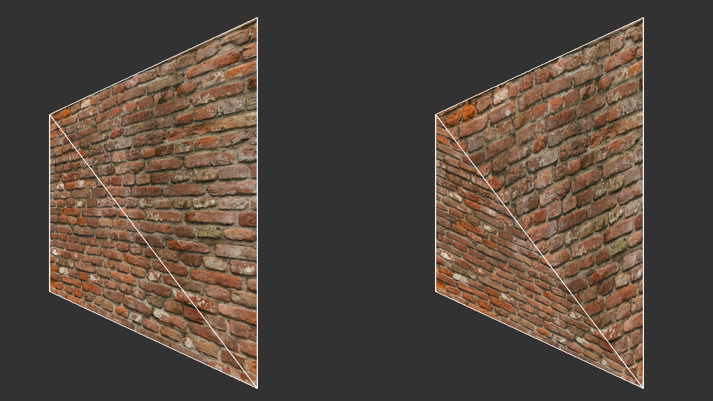
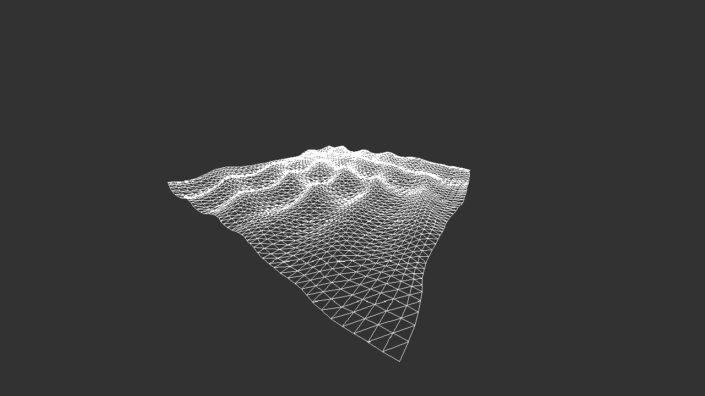

The goal of this project was for me to learn about the fundamentals of rasterization and realtime rendering. I had written a few ray tracers prior to this project, but never an actual rasterizer that could render hundreds of triangles at a reasonable framerate. I started by following Youtube tutorials by [javidx9](https://www.youtube.com/channel/UC-yuWVUplUJZvieEligKBkA) and [thebennybox](https://www.youtube.com/user/thebennybox). I later searched up individual topics to make sure I understood each part of the process. The gained knowledge could then be combined into this project, and I also implemented extra features which interested me.
# Features
* Rasterizes triangles in realtime
* Transforms triangles from local space all the way to screen space
* Clipping
* Perspective correct texturing
* Back-face culling and depth testing opaque geometry
* Load and render OBJ-models
* Custom functions for applying calculations on vertices and pixels, similar to shaders but on the CPU

# The Scenes
The project contains six scenes to showcase different aspects of the engine:
1. Textured quad to easier visualise clipping
2. Textured quad rendered using a "CPU pixel shader"
3. Monkey head loaded from an OBJ-file
4. Monkey head rendered using a "CPU pixel shader"
5. Gerstner waves using a "CPU vertex shader"
6. A TempleOS animation. (It was implemented mostly because I thought the dithered shading looked interesting)

# Running the Project
Eclipse 2021-03 is the recommended IDE, but most versions of Eclipse should work.

A first-person camera can be controlled when running the project. "WASDEQ" keys moves the camera while the arrow keys will rotate it. Pressing "R" switches between filled- and wireframe mode. Pressing "T" will switch between perspective correct- and affine texture mapping. The number keys 1-6 switches the current scene to one of the scenes listed above.

# Screenshots

