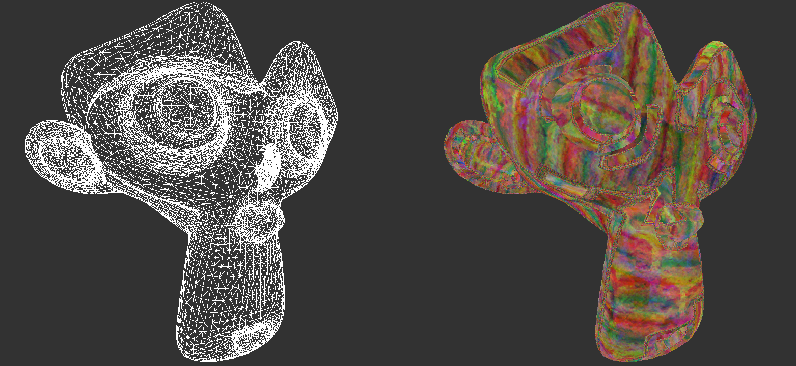

# Features
* Rasterizes triangles in realtime
* Transforms triangles from local space all the way to screen space
* Clipping
* Perspective correct texturing
* Back-face culling and depth testing opaque geometry
* Load and render OBJ-models
* Custom functions for applying calculations on vertices and pixels, similar to shaders but on the CPU

# The Scene
The project contains six scenes to showcase different aspects of the engine:
1. Textured quad to easier visualise clipping
2. Textured quad rendered using a "CPU pixel shader"
3. Monkey head loaded from an OBJ-file
4. Monkey head rendered using a "CPU pixel shader"
5. Gerstner waves using a "CPU vertex shader"
6. A TempleOS animation. (It was implemented mostly because I thought the dithered shading looked interesting)

# Running the Project
Eclipse 2021-03 is the recommended IDE, but most versions of Eclipse should work.

A first-person camera can be controlled when running the project. "WASDEQ" keys will move the camera while the arrow keys will rotate it. Pressing "R" will switch between filled- and wireframe mode. Pressing "T" will switch between perspective correct- and affine texture mapping. The number keys 1-6 will switch the current scene to one of the scenes listed above.
